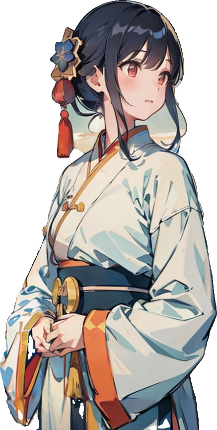
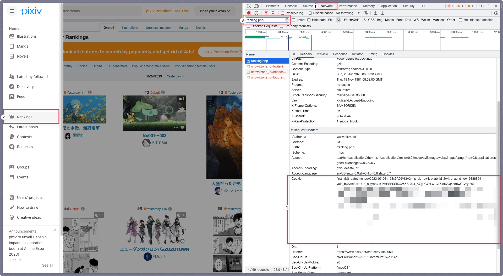

<div align="center">

# Character Image Preprocessing


[](https://www.python.org)
</div>

## 简介

基于Python的角色图像预处理工具，通过自动背景透明化、角色裁剪、图片无损放大等操作，将角色图像转换为可用于训练的数据集。

### 图片处理对比（以下图片均由SD生成）
<div align="center">
    <table>
        <tr>
            <td>原始图片</td>
            <td>处理后图片</td>
        </tr>
        <tr>
            <td></td>
            <td></td>
        </tr>
        <tr>
            <td></td>
            <td></td>
        </tr>
        <tr>
            <td></td>
            <td></td>
        </tr>
    </table>
</div>

## 使用方法

### 要求

- Python 3.10或更高版本及其依赖包
- Git (可选)

### 安装
1. 克隆存储库或者[下载zip](https://github.com/Inupedia/sd-character-image-preprocessing/archive/refs/heads/main.zip)：
   ```bash
   git clone https://github.com/Inupedia/sd-character-image-preprocessing
   ```
2. 安装所需的软件包：
   ```bash
   pip install -r requirements.txt 
   ```
3. 将配置文件`module/config_temp.py`更改为`config.py`
4. 

### 使用图片预处理
1. 添加模型文件：所有的模型都存储在`.u2net`文件夹中（例如/Users/username/.u2net），以下为参考模型：
   1. u2net ([下载](https://github.com/danielgatis/rembg/releases/download/v0.0.0/u2net.onnx), [源码](https://github.com/xuebinqin/U-2-Net))：适用于一般用途的预训练模型
   2. u2netp ([下载](https://github.com/danielgatis/rembg/releases/download/v0.0.0/u2netp.onnx), [源码](https://github.com/xuebinqin/U-2-Net))：u2net模型的轻量版
   3. u2net_human_seg ([下载](https://github.com/danielgatis/rembg/releases/download/v0.0.0/u2net_human_seg.onnx), [源码](https://github.com/xuebinqin/U-2-Net))：适用于人体分割的预训练模型
   4. u2net_cloth_seg ([下载](https://github.com/danielgatis/rembg/releases/download/v0.0.0/u2net_cloth_seg.onnx), [源码](https://github.com/levindabhi/cloth-segmentation))：适用于从人像中解析衣物的预训练模型，此处的衣物被解析为三类：上半身、下半身和全身
   5. silueta ([下载](https://github.com/danielgatis/rembg/releases/download/v0.0.0/silueta.onnx), [源码](https://github.com/xuebinqin/U-2-Net/issues/295))：与u2net相同，但大小减少到43Mb
   6. isnet-general-use ([下载](https://github.com/danielgatis/rembg/releases/download/v0.0.0/isnet-general-use.onnx), [源码](https://github.com/xuebinqin/DIS))：新的适用于一般用途的预训练模型
   7. isnet-anime ([下载](https://github.com/danielgatis/rembg/releases/download/v0.0.0/isnet-anime.onnx), [源码](https://github.com/SkyTNT/anime-segmentation))：适用于动漫角色的高精度分割模型
   8. sam ([下载编码器](https://github.com/danielgatis/rembg/releases/download/v0.0.0/vit_b-encoder-quant.onnx), [下载解码器](https://github.com/danielgatis/rembg/releases/download/v0.0.0/vit_b-decoder-quant.onnx), [源码](https://github.com/facebookresearch/segment-anything))：适用于任何用途的预训练模型
2. 修改`config.py`中以下配置，格式如下：
   ```python
    IMAGE_CONFIG = {
        # 修改为对应的模型名称，如isnet-anime
        "REMBG_MODEL": "u2net",
    }
   ```
3. 将需要处理的图片放入`src/input`文件夹中
4. 运行`main.py`：
   ```bash
   python main.py
   ```

### 使用pixiv爬虫
1. 修改`config.py`中以下配置，格式如下：
   ```python
    NETWORK_CONFIG = {
        # 代理设置（Clash无需修改，SSR需要修改端口号）
        "PROXY": {"https": "127.0.0.1:7890"},
    }
    USER_CONFIG = {
        "USER_ID": "修改成自己的uid，参考个人资料页面的网址https://www.pixiv.net/users/{UID}",
        "COOKIE": "修改成自己的cookie，获取方式参考以下图文",
    }
   ```
   - 获取cookie的方法：
     1. 登录[pixiv](https://www.pixiv.net/)
     2. 按F12打开开发者工具
     3. 点击Network
     4. 访问排行榜并刷新页面
     5. 找到ranking.php并复制其Request Headers中的cookie
        <div>
            </img>
        </div>
        
2. 根据画师ID爬取其pixiv的图片：
   ```bash
   python main.py --pixiv
   ```

### 使用图片命名
1. 修改`config.py`中以下配置，格式如下：
   ```python
    IMAGE_CONFIG = {
        # 修改为对应的前缀名称，如illust，将会生成illust_1.jpg、illust_2.jpg等
        "IMAGE_PREFIX": "illust",
    }
   ```
1. 将需要处理的图片放入`src/input`文件夹中
2. 运行`main.py`：
   ```bash
   python main.py --rename
   ```

## 后续更新
- [ ] 根据人脸位置进行正方形图片裁剪
- [ ] 无损放大图片
  
## 参考项目
- [Pixiv爬虫](https://github.com/CWHer/PixivCrawler)
- [背景去除](https://github.com/danielgatis/rembg)


## 许可证
[MIT License](./license)