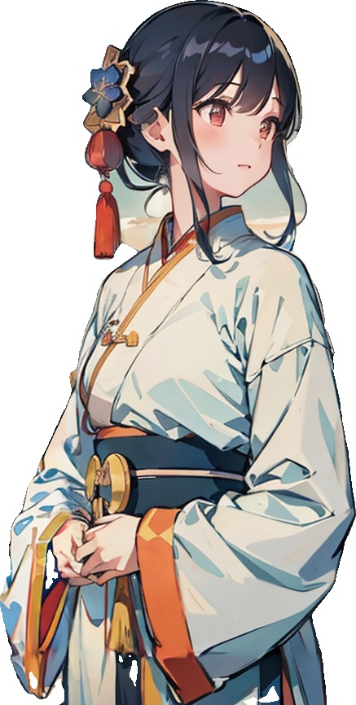
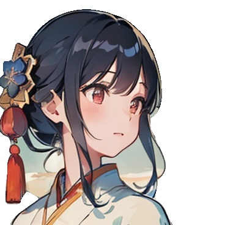
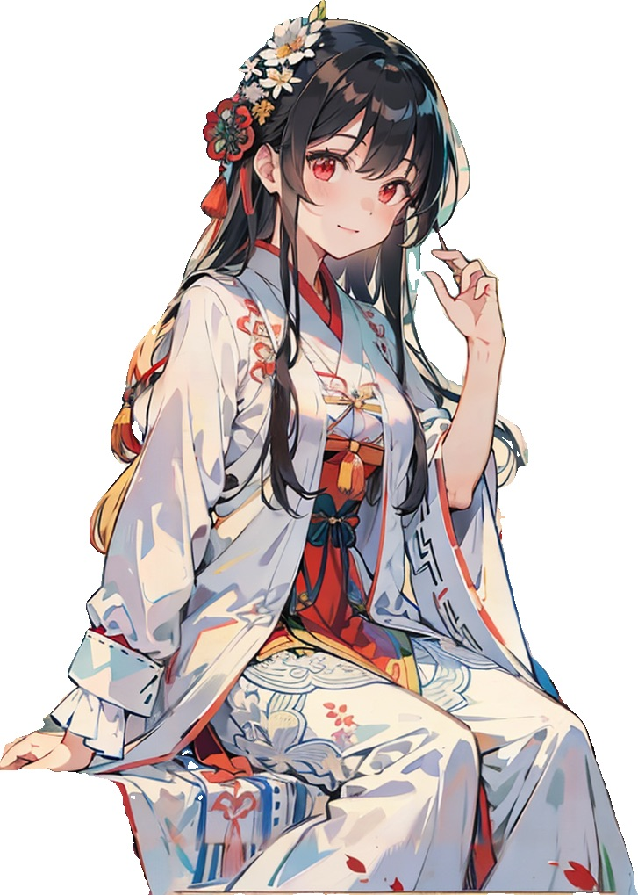
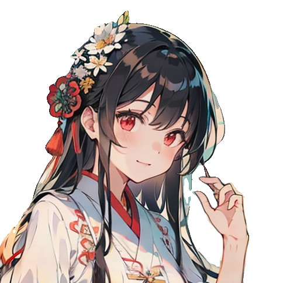
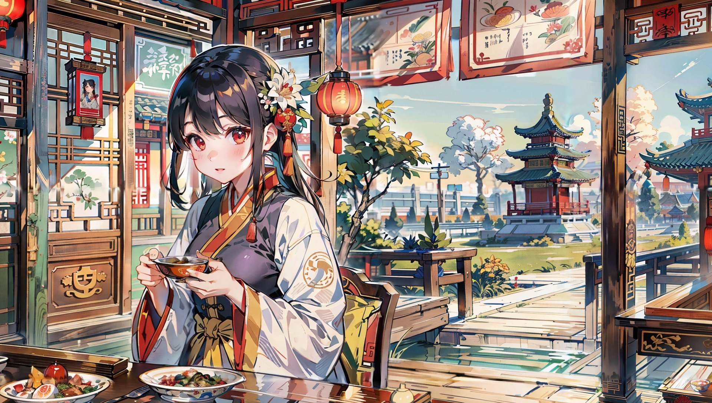
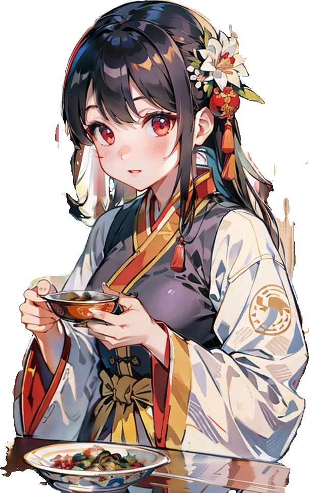
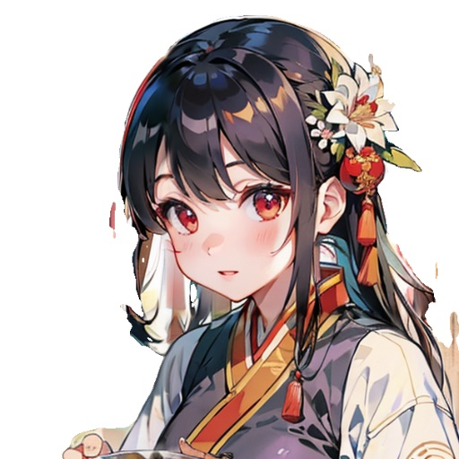
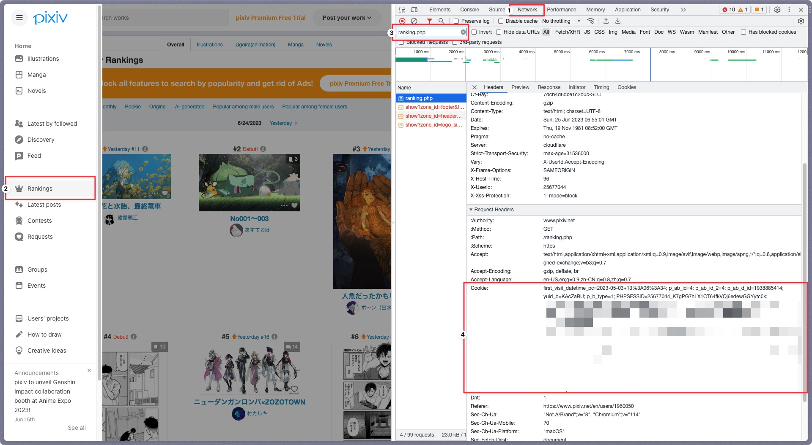

<div align="center">

# 动漫角色图片预处理


[](https://www.python.org)
</div>

## 简介

基于Python的角色图像预处理工具，通过背景透明化、边缘裁剪、智能裁剪、图片无损放大等操作，将角色图像转换为可用于训练的数据集。

### 图片处理对比（以下图片均由SD生成）
<div align="center">
    <table>
        <tr>
            <td>原始图片</td>
            <td>边缘裁剪</td>
            <td>智能裁剪 (512 * 512)</td>
        </tr>
        <tr>
            <td></td>
            <td></td>
            <td></td>
        </tr>
        <tr>
            <td></td>
            <td></td>
            <td></td>
        </tr>
        <tr>
            <td></td>
            <td></td>
            <td></td>
        </tr>
    </table>
</div>

## 使用方法及项目功能
每个功能都可以独立执行，也可以通过[混合指令](#混合指令)进行搭配使用。
1. [背景去除](#背景去除)
2. [边缘裁剪](#边缘裁剪)
3. [智能裁剪](#智能裁剪)
4. [图片放大(进行中)](#图片放大)
5. [图片命名](#图片命名)
6. [PIXIV图片下载](#pixiv图片下载)

### 要求

- Python 3.10或更高版本及其依赖包（见`requirements.txt`）
- Git (可选)

### 安装
1. 克隆存储库或者[下载zip](https://github.com/Inupedia/sd-character-image-preprocessing/archive/refs/heads/main.zip)：
   ```bash
   git clone https://github.com/Inupedia/sd-character-image-preprocessing
   ```
2. 进入项目文件夹创建python环境并激活（可选）：
   ```bash
   cd sd-character-image-preprocessing
   python3.11 -m venv venv #这里采用3.11版本
   source venv/bin/activate
   ```
3. 安装所需的软件包：
   ```bash
   pip install -r requirements.txt 
   ```
4. 将配置文件`module/config_temp.py`更改为`config.py`
   
### 背景去除
根据人物检测模型进行背景去除，请根据自己的需求选择模型（如isnet-anime对应二次元角色）。
1. 添加模型文件：所有的模型都存储在`.u2net`文件夹中（例如/Users/username/.u2net），以下为参考模型：
   1. u2net ([下载](https://github.com/danielgatis/rembg/releases/download/v0.0.0/u2net.onnx), [源码](https://github.com/xuebinqin/U-2-Net))：适用于一般用途的预训练模型
   2. u2netp ([下载](https://github.com/danielgatis/rembg/releases/download/v0.0.0/u2netp.onnx), [源码](https://github.com/xuebinqin/U-2-Net))：u2net模型的轻量版
   3. u2net_human_seg ([下载](https://github.com/danielgatis/rembg/releases/download/v0.0.0/u2net_human_seg.onnx), [源码](https://github.com/xuebinqin/U-2-Net))：适用于人体分割的预训练模型
   4. u2net_cloth_seg ([下载](https://github.com/danielgatis/rembg/releases/download/v0.0.0/u2net_cloth_seg.onnx), [源码](https://github.com/levindabhi/cloth-segmentation))：适用于从人像中解析衣物的预训练模型，此处的衣物被解析为三类：上半身、下半身和全身
   5. silueta ([下载](https://github.com/danielgatis/rembg/releases/download/v0.0.0/silueta.onnx), [源码](https://github.com/xuebinqin/U-2-Net/issues/295))：与u2net相同，但大小减少到43Mb
   6. isnet-general-use ([下载](https://github.com/danielgatis/rembg/releases/download/v0.0.0/isnet-general-use.onnx), [源码](https://github.com/xuebinqin/DIS))：新的适用于一般用途的预训练模型
   7. isnet-anime ([下载](https://github.com/danielgatis/rembg/releases/download/v0.0.0/isnet-anime.onnx), [源码](https://github.com/SkyTNT/anime-segmentation))：适用于动漫角色的高精度分割模型
   8. sam ([下载编码器](https://github.com/danielgatis/rembg/releases/download/v0.0.0/vit_b-encoder-quant.onnx), [下载解码器](https://github.com/danielgatis/rembg/releases/download/v0.0.0/vit_b-decoder-quant.onnx), [源码](https://github.com/facebookresearch/segment-anything))：适用于任何用途的预训练模型
2. 修改`config.py`中以下配置，格式如下：
   ```python
    IMAGE_CONFIG = {
        # 修改为对应的模型名称，如isnet-anime
        "REMBG_MODEL": "u2net",
    }
   ```
3. 将需要处理的图片放入`src/input`文件夹中
4. 运行`main.py`：
   ```bash
   python main.py -remove-bg
   ```

### 边缘裁剪
普通的裁剪只会将多余的白色背景部分进行最大程度的剪切，需配合背景去除达到人物裁剪的效果。
1. 修改`config.py`中以下配置，格式如下：
   ```python
    IMAGE_CONFIG = {
        # 修改裁剪图片目标的存放路径及保持路径，默认修改src/output下的文件并存储为“原名_crop.png”在同一路径下，如需不同路径请先生成对应路径
        "BOUNDARY_CROP_INPUT_DIR": "./src/rm_bg_output/",
        "BOUNDARY_CROP_OUTPUT_DIR": "./src/boundary_crop_output/",
    }
   ```
2. 运行`main.py`：
   ```bash
   python main.py --boundary-crop
   ```

### 智能裁剪
智能裁剪可以搭配背景去除使用，注意在图像分辨率不高的情况下裁剪的人物会低512x512，因此建议裁剪后进行放大处理。一图多人的情况下会根据脸部特征自动裁剪出多张图片，但不适用太密集的情况。
1. 修改`config.py`中以下配置，格式如下：
   ```python
    IMAGE_CONFIG = {
        # 修改裁剪图片目标的存放路径及保持路径，默认修改src/output下的文件并存储为“原名_smartcrop_数字.png”在同一路径下，如需不同路径请先生成对应路径
        "SMART_CROP_INPUT_DIR": "./src/rm_bg_output/",
        "SMART_CROP_OUTPUT_DIR": "./src/smart_crop_output/",
    }
   ```
2. 运行`main.py`：
   ```bash
   python main.py --smart-crop
   ```

### 图片放大
进行中

### 图片命名
1. 修改`config.py`中以下配置，格式如下：
   ```python
    IMAGE_CONFIG = {
        # 修改为对应的前缀名称，如illust，将会生成illust_1.jpg、illust_2.jpg等
        "IMAGE_PREFIX": "illust",
    }
   ```
2. 将需要处理的图片放入`src/input`文件夹中
3. 运行`main.py`：
   ```bash
   python main.py --rename
   ```

### PIXIV图片下载
此功能主要满足两个需求，一通过画师ID下载画师的所有作品，二通过关键字下载相关作品（数量会根据对应页数进行下载）。
1. <strong>爬虫请遵守Pixiv的[相关规定](https://www.pixiv.net/robots.txt)</strong>
2. 修改`config.py`中以下配置，格式如下：
   ```python
    NETWORK_CONFIG = {
        # 代理设置（Clash无需修改，SSR需要修改端口号）
        "PROXY": {"https": "127.0.0.1:7890"},
    }
    USER_CONFIG = {
        "USER_ID": "修改成自己的uid，参考个人资料页面的网址https://www.pixiv.net/users/{UID}",
        "COOKIE": "修改成自己的cookie，获取方式参考以下图文",
    }
   ```
   - 获取cookie的方法：
     1. 登录[pixiv](https://www.pixiv.net/)
     2. 按F12打开开发者工具
     3. 点击Network
     4. 访问排行榜并刷新页面
     5. 找到ranking.php并复制其Request Headers中的cookie
        <div>
            </img>
        </div>
        
3. 根据画师ID爬取其pixiv的图片：
   ```bash
   python main.py --pixiv-user 画师ID
   ```
4. 根据关键字进行下载：
   1. 修改`config.py`中以下配置，格式如下：
      ```python
       IMAGE_CONFIG = {
            "KEYWORD_ORDER": True,  # True: 按照热度排序，False: 按照最新排序
            "KEYWORD_N_PAGES": 5,  # 1页为60张图片，实际一页数量会大于60因为有些画集会有多张图片
            "KEYWORD_MODE": "safe",  # safe / r18 / all 你懂的
       }
      ```
    2. （PIXIV会员功能）关键字可以通过组合的方式进行精确搜索，如"50000users AND hutao"
        ```bash
        python main.py --pixiv-keyword "关键字"
        ```
    
### 混合指令
混合指令可以满足多任务按先后顺序执行，如果想要同时使用多个指令，可以使用组合如下。
   ```bash
   python main.py --rename --remove-bg --boundary-crop #先重命名，再对图片去除背景并边缘裁剪
   ```

## 后续更新（如果有需求🤣）
- [ ] 无损放大图片
  
## 参考项目
- [PixivCrawler](https://github.com/CWHer/PixivCrawler)
- [rembg](https://github.com/danielgatis/rembg)
- [Real-ESRGAN](https://github.com/xinntao/Real-ESRGAN)


## 许可证
[MIT License](https://github.com/Inupedia/sd-character-image-preprocessing/blob/main/LICENSE)