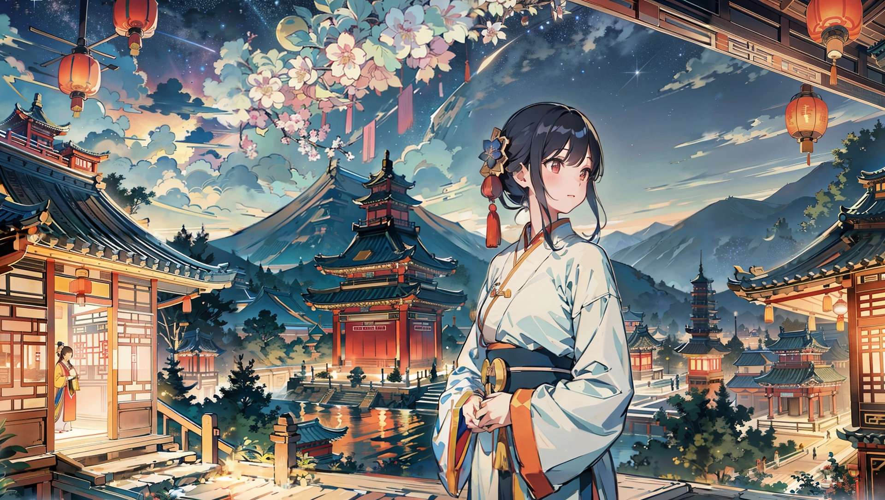

- [Anime Character Image Preprocessing](#anime-character-image-preprocessing)
  - [Introduction](#introduction)
    - [Image Processing Comparison (All images below are generated by SD)](#image-processing-comparison-all-images-below-are-generated-by-sd)
  - [Usage and Project Features](#usage-and-project-features)
    - [Requirements](#requirements)
    - [Installation](#installation)
    - [Background Removal](#background-removal)
    - [Boundary Cropping](#boundary-cropping)
    - [Smart Cropping](#smart-cropping)
    - [Image Tagging](#image-tagging)
    - [Image Enlargement](#image-enlargement)
    - [Image Naming](#image-naming)
    - [PIXIV Image Downloader](#pixiv-image-downloader)
    - [Mixed Commands](#mixed-commands)
  - [Reference](#reference)
  - [License](#license)
<div align="center">

# Anime Character Image Preprocessing
<div align="center"><b><a href="README.md">English</a> | <a href="README_CN.md">简体中文</a></b></div>


[](https://www.python.org)
</div>

## Introduction

A Python-based character image preprocessing tool that transforms character images into a dataset suitable for training through background transparency, boundary cropping, smart cropping, image tagging, image enlargement, etc.

### Image Processing Comparison (All images below are generated by SD)
<div align="center">
    <table>
        <tr>
            <td>Original Image</td>
            <td>Edge Cropping</td>
            <td>Smart Cropping (512 * 512)</td>
        </tr>
        <tr>
            <td></td>
            <td></td>
            <td></td>
        </tr>
        <tr>
            <td></td>
            <td></td>
            <td></td>
        </tr>
        <tr>
            <td></td>
            <td></td>
            <td></td>
        </tr>
    </table>
</div>

## Usage and Project Features
Each function can be executed independently, or they can be used in combination through [mixed commands](#mixed-commands).

### Requirements

- Python 3.10 or higher and its dependencies（check `requirements.txt`）
- Git (optional)

### Installation
1. Clone the repository or [download zip](https://github.com/Inupedia/sd-character-image-preprocessing/archive/refs/heads/main.zip)：
   ```bash
   git clone https://github.com/Inupedia/sd-character-image-preprocessing
   ```
2. Navigate to the project folder to create and activate the Python environment (optional):
   ```bash
   cd sd-character-image-preprocessing
   python3.11 -m venv venv # 3.11 version in this case
   source venv/bin/activate
   ```
3. Install the required packages:
   ```bash
   pip install -r requirements.txt 
   ```
4. Change the configuration file `module/config_temp.py` to `config.py`.
   
### Background Removal
Background removal is based on the character detection model. Please choose the model according to your needs (such as isnet-anime corresponds to secondary character).

1. All models are downloaded and saved in the user home folder in the `.u2net` directory.

    The available models are:

-   u2net ([download](https://github.com/danielgatis/rembg/releases/download/v0.0.0/u2net.onnx), [source](https://github.com/xuebinqin/U-2-Net)): A pre-trained model for general use cases.
-   u2netp ([download](https://github.com/danielgatis/rembg/releases/download/v0.0.0/u2netp.onnx), [source](https://github.com/xuebinqin/U-2-Net)): A lightweight version of u2net model.
-   u2net_human_seg ([download](https://github.com/danielgatis/rembg/releases/download/v0.0.0/u2net_human_seg.onnx), [source](https://github.com/xuebinqin/U-2-Net)): A pre-trained model for human segmentation.
-   u2net_cloth_seg ([download](https://github.com/danielgatis/rembg/releases/download/v0.0.0/u2net_cloth_seg.onnx), [source](https://github.com/levindabhi/cloth-segmentation)): A pre-trained model for Cloths Parsing from human portrait. Here clothes are parsed into 3 category: Upper body, Lower body and Full body.
-   silueta ([download](https://github.com/danielgatis/rembg/releases/download/v0.0.0/silueta.onnx), [source](https://github.com/xuebinqin/U-2-Net/issues/295)): Same as u2net but the size is reduced to 43Mb.
-   isnet-general-use ([download](https://github.com/danielgatis/rembg/releases/download/v0.0.0/isnet-general-use.onnx), [source](https://github.com/xuebinqin/DIS)): A new pre-trained model for general use cases.
-   isnet-anime ([download](https://github.com/danielgatis/rembg/releases/download/v0.0.0/isnet-anime.onnx), [source](https://github.com/SkyTNT/anime-segmentation)): A high-accuracy segmentation for anime character.
-   sam ([download encoder](https://github.com/danielgatis/rembg/releases/download/v0.0.0/vit_b-encoder-quant.onnx), [download decoder](https://github.com/danielgatis/rembg/releases/download/v0.0.0/vit_b-decoder-quant.onnx), [source](https://github.com/facebookresearch/segment-anything)): A pre-trained model for any use cases.
2. Modify the following configurations in `config.py`, the format is as follows:
   ```python
    IMAGE_CONFIG = {
        # Change to the corresponding model name, such as isnet-anime
        "REMBG_MODEL": "u2net",
    }
   ```
3. Put the images that need to be processed into the `src/input` folder.
4. run `main.py`:
   ```bash
   python main.py --remove-bg
   ```

### Boundary Cropping
Boundary cropping uses an algorithm to find the boundary of the object and remove excess space.
1. Modify the following configurations in `config.py`, the format is as follows:
   ```python
    IMAGE_CONFIG = {
        # Modify the target path for cropping images and the path for saving. By default, modify the files under src/output and save them as "original_name_crop.png" in the same path. If you need a different path, please generate the corresponding path first
        "BOUNDARY_CROP_INPUT_DIR": "./src/rm_bg_output/",
        "BOUNDARY_CROP_OUTPUT_DIR": "./src/boundary_crop_output/",
    }
   ```
2. Run `main.py`：
   ```bash
   python main.py --boundary-crop
   ```

### Smart Cropping
Smart cropping can be used in conjunction with background removal. Please note that when the image resolution is not high, the cropped character will be below 512x512, so it is recommended to enlarge the image after cropping. In the case of multiple people in one picture, multiple images will be automatically cropped based on facial features, but it's not applicable for too dense scenarios.
1. Modify the following configurations in `config.py`, the format is as follows:
   ```python
    IMAGE_CONFIG = {
        # Modify the target path for cropping images and the path for saving. By default, modify the files under src/output and save them as "original_name_smartcrop_number.png" in the same path. If you need a different path, please generate the corresponding path first
        "SMART_CROP_INPUT_DIR": "./src/rm_bg_output/",
        "SMART_CROP_OUTPUT_DIR": "./src/smart_crop_output/",
        # Model address, no need to change
        "HF_REPO_ID": "inupedia/anime-character-image-preprocessing",
        "HF_MODEL_DIR": "./module/model/",
    }
   ```
2. Run `main.py`：
   ```bash
    python main.py --smart-crop auto # Recommended, scale factor parameter can be adjusted, for example --smart-crop auto 1.5
    python main.py --smart-crop auto-fast # Based on lbpcascade_animeface.xml for automatic cropping, fast speed, but may miss some characters
   ```

### Image Tagging
| Original Image | Tagger (50% Confidence) |
| :--------: | :--------: |
|  [^1] | boat, lily pad, flower, multiple girls, 2girls, water, watercraft, lotus, hanfu, sitting, outdoors, black hair, hair flower, hair ornament, chinese clothes, day, holding, long hair, long sleeves, sash, smile, pink flower, looking at another, bangs, hair bun, sidelocks, braid, single hair bun |

1. Modify the following configurations in `config.py`, the format is as follows:
   ```python
    IMAGE_CONFIG = {
        "IMAGE_TAGGER_INPUT_DIR": "./src/input/", # Directory of images that need tags
        "IMAGE_TAGGER_CONFIDENCE": 0.5, # Confidence, the higher the more accurate, but some tags may be missed
    }
   ```
2. The model will be automatically downloaded to the corresponding folder. You can manually download [wd-v1-4-convnextv2-tagger-v2 model](https://huggingface.co/SmilingWolf/wd-v1-4-convnextv2-tagger-v2/blob/main/model.onnx) and [selected_tags](https://huggingface.co/SmilingWolf/wd-v1-4-convnextv2-tagger-v2/blob/main/selected_tags.csv) into the `module/image_tagger/model` folder.
3. Run `main.py`：
   ```bash
   python main.py --tag
   ```

### Image Enlargement
Base on REAL-ESRGAN, a practical algorithm for single image super-resolution with realistic textures. [^2]

### Image Naming
1. Modify the following configurations in `config.py`, the format is as follows:
   ```python
     IMAGE_CONFIG = {
        # Change to the corresponding prefix name, such as illust, it will generate illust_1.jpg, illust_2.jpg, etc.
        "IMAGE_PREFIX": "illust",
     }
   ```
2. Put the images that need to be processed into the `src/input` folder.
3. Run `main.py`：
   ```bash
   python main.py --rename
   ```

### PIXIV Image Downloader
This function mainly meets two needs, one is to download all the works of the artist through the artist ID, and the other is to download relevant works through keywords (the number will be downloaded according to the corresponding pages).
1. <strong>Please abide by Pixiv's [relevant regulations](https://www.pixiv.net/robots.txt) for crawling</strong>
2. Modify the following configurations in `config.py`, the format is as follows:
   ```python
     NETWORK_CONFIG = {
        # Proxy settings (no need to modify for Clash, port number needs to be modified for SSR)
        "PROXY": {"https": "127.0.0.1:7890"},
    }
    USER_CONFIG = {
        "USER_ID": "Change to your own uid, refer to the URL of the personal profile page https://www.pixiv.net/users/{UID}",
        "COOKIE": "Change to your own cookie, the acquisition method refers to the following graphic",
    }
   ```
   - How to get cookies：
     1. Log in to [pixiv](https://www.pixiv.net/)
     2. Press F12 to open the developer tools
     3. Click on `Network`
     4. Visit the ranking list and refresh the page
     5. Find ranking.php and copy the cookie from its Request Headers
        <div>
            </img>
        </div>
   
3. Crawl its pixiv images according to the artist ID:
   ```bash
   python main.py --pixiv-user artist_ID
   ```
4. Download according to keywords:
   1. Modify the following configurations in `config.py`, the format is as follows:
      ```python
        IMAGE_CONFIG = {
            "KEYWORD_ORDER": True,  # True: Sort by popularity, False: Sort by newest
            "KEYWORD_N_PAGES": 5,  # 1 page is 60 images, the actual number per page will be more than 60 because some galleries will have multiple images
            "KEYWORD_MODE": "safe",  # safe / r18 / all
        }
      ```
    2. (PIXIV member feature) Keywords can be searched accurately by combining, such as "50000users AND hutao"
        ```bash
        python main.py --pixiv-keyword "keyword"
        ```
   
### Mixed Commands
Mixed commands can satisfy multiple tasks to be executed in order. If you want to use multiple commands at the same time, you can use the combination as follows.
   ```bash
   python main.py --rename --remove-bg --boundary-crop # Rename first, then remove the background of the image and crop the edge
   ```

## Reference
- [PixivCrawler](https://github.com/CWHer/PixivCrawler)
- [rembg](https://github.com/danielgatis/rembg)
- [Real-ESRGAN](https://github.com/xinntao/Real-ESRGAN)
- [anime_object_detection](https://huggingface.co/spaces/deepghs/anime_object_detection)
- [wd-v1-4-convnextv2-tagger-v2](https://huggingface.co/SmilingWolf/wd-v1-4-convnextv2-tagger-v2)

## License
[MIT License](/LICENSE)

[^1]: [误入藕花深处](https://www.liblibai.com/imageinfo/332ef1eda104a78f9132d4c79d9a7f69)
[^2]: [xinntao/Real-ESRGAN](https://github.com/xinntao/Real-ESRGAN)